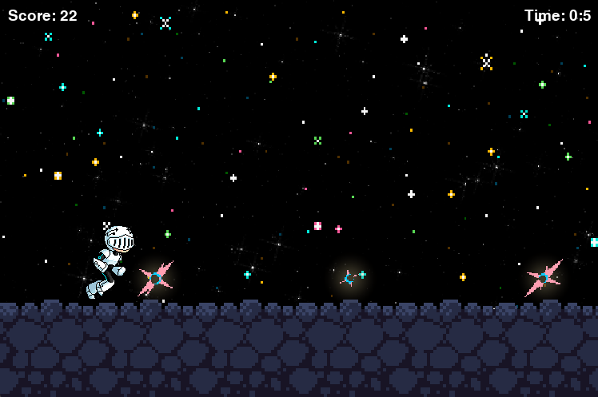
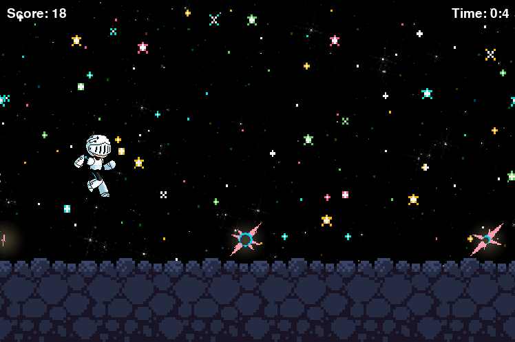

# Runner Game

<div align="center">
    
</div>
</br>
<div align="center">
    
    
    
    
</div>

## Overview

A side-scrolling endless runner game developed in Python utilizing the Pygame library.

<div align="center">
    
    
</div>

## Installation

1. Clone the repository:

```
git clone https://github.com/venusWaltz/runner-game.git
```

2. Navigate to the project directory:

```
cd runner-game
```

3. Install the required dependencies:

```
pip install -r requirements.txt
```

## Running the Game

To start the game, run the following command in the project directory:

```
python3 runnergame/main.py
```

## Game Controls

- UP Arrow Key: Jump
- ESCAPE Key: Exit to the main menu

## Configuration

Game settings can be modified in the `config.toml` file or the `constants.py` file.

## Documentation Reference

- [Python](https://docs.python.org/3/)
- [Pygame](https://www.pygame.org/wiki/GettingStarted)
- [Pygame Menu](https://pygame-menu.readthedocs.io/en/latest/)
- [TOML](https://pypi.org/project/toml/)
